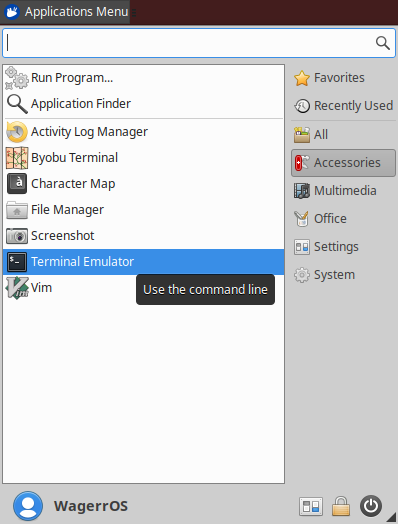
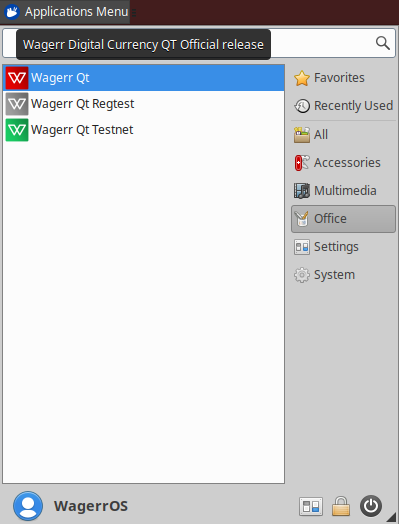

Installing Wagerr on Raspbery Pi 3+
============
Install and Configure Ubuntu Server 18.04 for Raspberry Pi
------------
- Download Ubuntu 18.04 Server for Raspberry Pi from [Ubuntu](https://www.ubuntu.com/download/iot/raspberry-pi-2-3)
- Install on Raspberry Pi following Ubuntu's directions
- Boot up the Raspberry Pi and login using the username ubuntu and the password ubuntu - you will be asked to change the password before you log in
- Run the following commands:

    sudo growpart /dev/mmcblk0 2 (to grow root partiton to fill disk)  
    sudo resize2fs /dev/mmcblk0p2 (to resize root partiton to use all available space)  
    sudo apt-get update  
    sudo apt-get upgrade  
    sudo apt-get install xubuntu-core xorg  
    sudo systemctl set-default graphical  
    sudo reboot  

Install Wagerr coin software
--------------
- Using the Terminal Emulator Program found in Applications Menu -> Accessories, run the following commands

    sudo snap install core
    sudo snap install wagerr
    
- You will now be able to run the wagerr-qt software by going to Applications Menu -> Office -> Wagerr-qt

